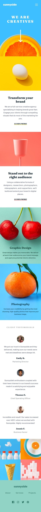
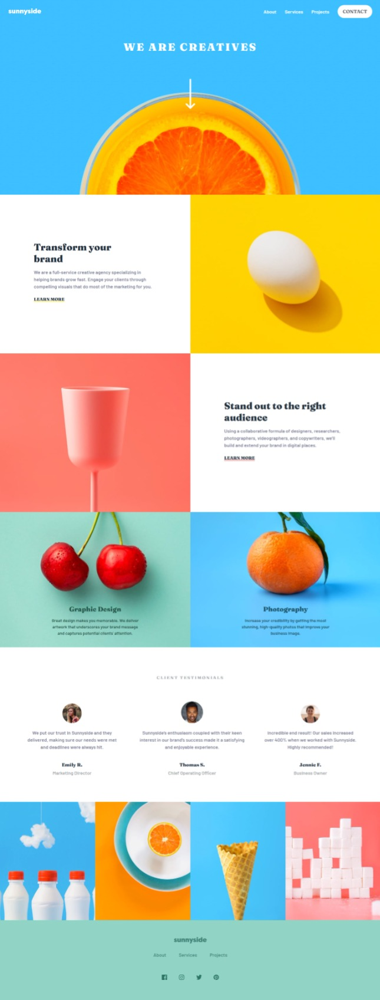

# Frontend Mentor - Sunnyside agency landing page solution

This is a solution to the [Sunnyside agency landing page challenge on Frontend Mentor](https://www.frontendmentor.io/challenges/sunnyside-agency-landing-page-7yVs3B6ef). Frontend Mentor challenges help you improve your coding skills by building realistic projects.

## Table of contents

- [Overview](#overview)
  - [The challenge](#the-challenge)
  - [Links](#links)
  - [Screenshot](#screenshot)
    - [Mobile-design](#mobile-design)
    - [Desktop-design](#desktop-design)
- [My process](#my-process)
  - [Built with](#built-with)
  - [Useful resources](#useful-resources)
- [Author](#author)

## Overview

### The challenge

Users should be able to:

- View the optimal layout for the site depending on their device's screen size
- See hover states for all interactive elements on the page

### Links

- Solution URL: [Frontend Mentor](https://your-solution-url.com)
- Live Site URL: [Netlify Page](https://sunnyside-agency-frontend-mentor-challenge.netlify.app/)

### Screenshot

#### Mobile design

#### Desktop design

## My process

### Built with

- HTML5
- CSS3
- CSS Grid
- Flexbox
- Mobile-first workflow

### Useful resources

- ["CSS Triangle" by Chris Coyier, CSS TRICKS](https://css-tricks.com/snippets/css/css-triangle/) - This helped me to style the menu for the mobile design.
- ["text-underline-offset" by MDN Web Docs](https://developer.mozilla.org/fr/docs/Web/CSS/text-underline-offset) - This documentation was helpful to style the text-decoration of "Learn more" link.

## Author

- GitHub - [Ax-cd](https://github.com/Ax-cd)
- Frontend Mentor - [@Ax-cd](https://www.frontendmentor.io/profile/Ax-cd)
- Instagram - [@ax.coding](https://www.instagram.com/ax.coding/)
